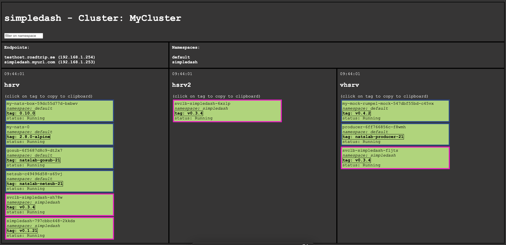
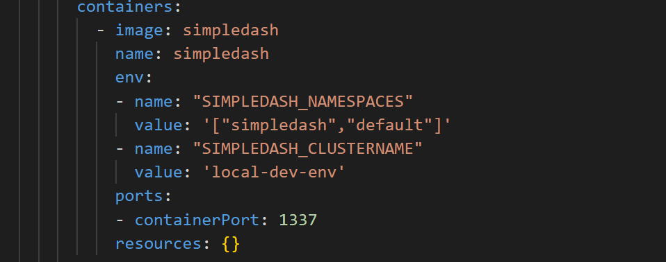

# simpledash

a simple, read-only, dashboard for your k8s cluster.




### try locally with skaffold 
1. install [skaffold](https://skaffold.dev/) (follow the quickstart guide: https://skaffold.dev/docs/quickstart/)
2. run ``skaffold run``  
3. in your browser navigate to ```localhost:1337```
4. review the default settings in ```./simpledash.yaml``` - e.g the namespaces being included in the setting ```SIMPLEDASH_NAMESPACES```:



### install in your k8s cluster
``kubectl apply -f https://raw.githubusercontent.com/hellgrenj/simpledash/main/deploy/v0.1/simpledash-with-ingress.yaml``  

But you **probably** want to download the yaml above and tweak things like: 
* tracked namespaces (deployment env var SIMPLEDASH_NAMESPACES, expecting json array)
*  cluster name (deployment env var SIMPLEDASH_CLUSTERNAME, expecting string)
* Ingress host, tls  
and more...

### so, what am I looking at?

Simpledash will scan your cluster every 10 seconds and push the cluster information over websockets to your browser. In the header you see "simpledash" and the name you set in the env variable ```SIMPLEDASH_CLUSTERNAME``` (see ./simpledash.yaml). In the top left corner you have a namespace filter option, this will dictate what is being presented below. You can also pass in an inital filter by using the ns query paramter, i.e ```localhost:1337?ns=simpledash```  

On the next row you can see any exposed ingress endpoints (per namespace) and the namespaces being monitored. Below this you can see the pods in your cluster and the nodes they live in. Each node has a timestamp in the upper-left corner so you can see how fresh the status/data is that you are looking at.

Each pod displays the:  
- pod name
- namespace
- tag
- status 

*..and if you hover the pod you can see the image name*  

pods with status Running will have a green background.  
pods with status Failed will have a red background.  
Any other status = Yellow background.   
Pods in the same namespace will have the same border color.

(You can copy the image tag to your clipboard by clicking on it)


  
