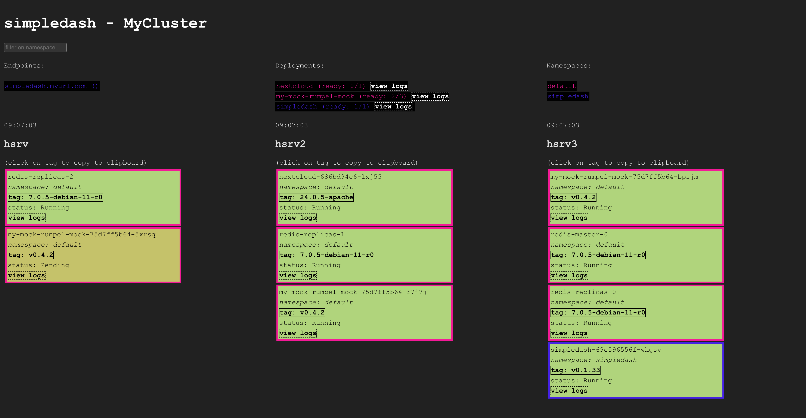

# simpledash

a simple, read-only, dashboard for your k8s cluster.

### install (*early days*)
``kubectl apply -f https://raw.githubusercontent.com/hellgrenj/simpledash/main/deploy/v0.1/simpledash-with-ingress.yaml``  

or download the example yaml above and tweak things like: 
* tracked namespaces (deployment env var SIMPLEDASH_NAMESPACES, expecting json array)
*  cluster name (deployment env var SIMPLEDASH_CLUSTERNAME, expecting string)
* Ingress host, tls  
and more...

### try locally with skaffold
``skaffold run``  
  
